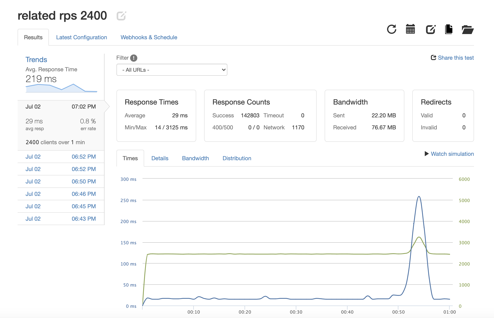

# Atelier

### Table of Contents
1. [General Info](#🌴-General-Info)
2. [Demo](#✨-Demo)
3. [Technologies](#🧪-Technologies)
4. [Installation](#🚀-Installation)
5. [Contributors](#🤝-Contributors)


### Optimizations
* Seeded a PostgreSQL database with over 10 million records
* Optimized raw SQL query execution times to average < 4ms per query using hash indexes and joins
* Improved throughput from around 100 requests per second to 2400 requests per second with low latency and < 1% error rate by horizontally scaling with multiple AWS servers and Nginx's load balancer


### General Info
Atelier is a project that aimed to optimize the performance of an outdated back-end service to support increasing production traffic. Our team transformed a single service application into a multiservice architecture using micro services. 

### ✨ Demo




### 🧪 Technologies
* Express : Version 4.17.1,
* New Relic : Version 7.5.1,
* Pg : Version 8.6.0,
* Pg Copy Streams : Version 5.1.1,
* Postgres : 1.0.2


### 🚀 Installation and Setup
```
$ git clone https://github.com/atelier.git
$ cd ../atelier
$ npm install
$ npm start
```


### 🤝 Contributors
- [Laura Kamphaus](https://github.com/lkamphaus)

